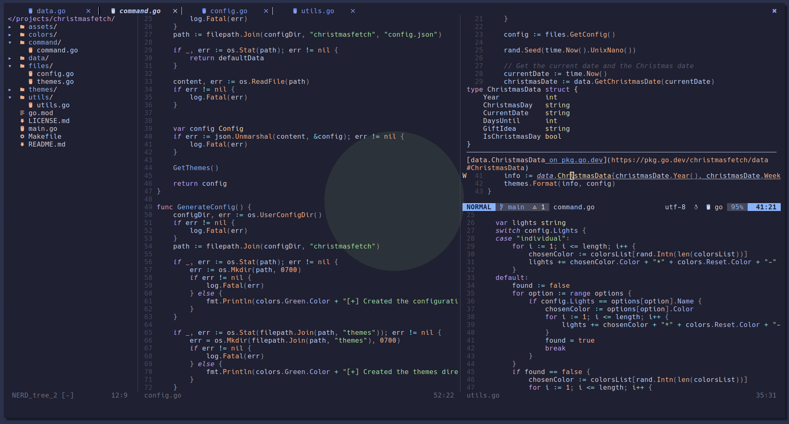

# My NeoVim Config

## New Keymaps

|Keymap    |Explanation
|----------|-----------
|Ctrl+Space|Opens NerdTree
|Ctrl+_    |Comments the line (or selection when highlighting)
|Ctrl+w    |Closes a tab
|Ctrl+n    |Creates a new tab
|Space+f+f |Telescope file finder
|Space+f+b |Telescope buffer finder
|Space+f+g |Telescope live grep
|g+d       |LSP definition
|K         |LSP hover 
|Space+f   |LSP formatting
|Ctrl+e   |CMP (code suggestion) abort
|Enter     |CMP (code suggestion) confirm
|Ctrl+b    |CMP (code suggestion) documentation scroll (up)
|Ctrl+f    |CMP (code suggestion) documentation scroll (down)

## Credits
Credits go to about a million online posts about NeoVim configuration!
