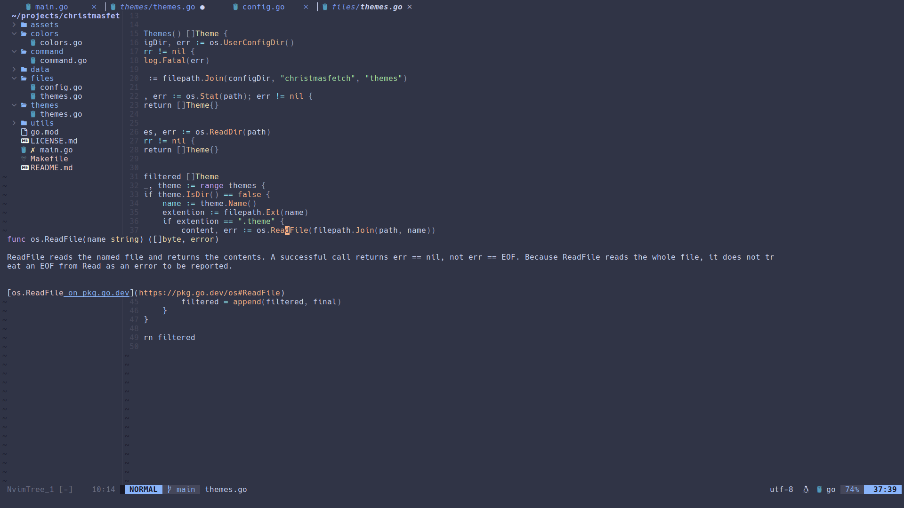

# My Neovim configuration!

# Keybinds

<table>
    <tr>
        <th>Bind</th>
        <th>Mode</th>
        <th>Usage</th>
    </tr>
    <tr>
        <td>ESC+ESC</td>
        <td>N</td>
        <td>Escapes highlighting</td>
    </tr>
    <tr>
        <td>F12</td>
        <td>N</td>
        <td>Starts a new terminal session</td>
    </tr>
    <tr>
        <td>Ctrl + Space</td>
        <td>N</td>
        <td>Toggles file tree</td>
    </tr>
    <tr>
        <td>Ctrl + _</td>
        <td>N</td>
        <td>Toggle a comment</td>
    </tr>
    <tr>
        <td>Ctrl + _</td>
        <td>V</td>
        <td>Toggle a comment (highlighted)</td>
    </tr>
    <tr>
        <td>Ctrl + n</td>
        <td>N</td>
        <td>Open a new tab</td>
    </tr>
    <tr>
        <td>Tab</td>
        <td>N</td>
        <td>Navigate right on the tab navigation</td>
    </tr>
    <tr>
        <td>Shift + Tab</td>
        <td>N</td>
        <td>Navigate left on the tab navigation</td>
    </tr>
    <tr>
        <td>Space (leader) + f + f</td>
        <td>N</td>
        <td>Launch Telescope file finder</td>
    </tr>
        <tr>
        <td>Space (leader) + f + g</td>
        <td>N</td>
        <td>Launch Telescope live grep</td>
    </tr>
    <tr>
        <td>Space (leader) + f + b</td>
        <td>N</td>
        <td>Launch Telescope buffer navigation</td>
    </tr>
    <tr>
        <td>g + d</td>
        <td>N</td>
        <td>Jump to definition</td>
    </tr>
    <tr>
        <td>K</td>
        <td>N</td>
        <td>Hover information</td>
    </tr>
    <tr>
        <td>Space + f</td>
        <td>N</td>
        <td>Format code</td>
    </tr>
    <tr>
        <td>Ctrl + b</td>
        <td>I</td>
        <td>Scroll down on a CMP suggestion box</td>
    </tr>
    <tr>
        <td>Ctrl + f</td>
        <td>I</td>
        <td>Scroll up on a CMP suggestion box</td>
    </tr>
    <tr>
        <td>Ctrl + e</td>
        <td>I</td>
        <td>Abort a CMP suggestion box</td>
    </tr>
    <tr>
        <td>Enter</td>
        <td>I</td>
        <td>Confirm suggestion from a CMP suggestion box</td>
    </tr>
</table>