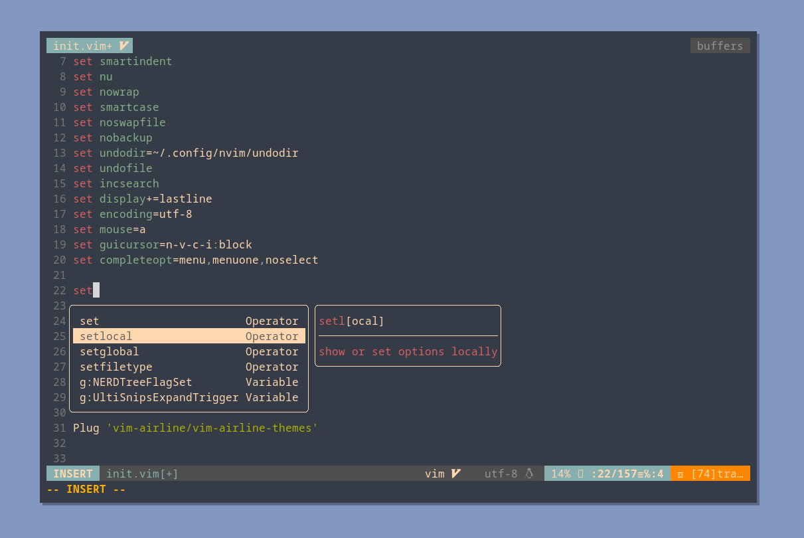

# My NeoVim Config
A slightly jank, however functional NeoVim config.

Note about the top screenshot: The background of the color theme (gruvbox) is stripped away in my config. My terminal above is transparent.

## Dependencies
- [NeoVim](https://github.com/neovim/neovim)
- [Vim Plug](https://github.com/junegunn/vim-plug)
- A [Nerd Font](https://github.com/ryanoasis/nerd-fonts) font
- **RUST LANGUAGE SERVER** [Rust Analyzer](https://github.com/rust-lang/rust-analyzer) (Partially optional, check the Lua section of the `init.vim` file and remove language servers as you wish from the `local servers`).
- **LANGUAGE SERVERS** `npm i -g typescript typescript-language-server @angular/language-server pyright vim-language-server vscode-langservers-extracted dockerfile-language-server-nodejs emmet-ls` (Partially optional, check the Lua section of the `init.vim` file and remove language servers as you wish from the `local servers`).
- I think that's it.. I have no clue about anything else!

## Installation
- Make sure you have all of the dependencies installed.
- Move the `init.vim` file into the `.config/nvim` directory. In there, also create the `undodir` and `plugged` directories.
- Launch NeoVim with `nvim` and run `:PlugInstall`.
- That should be it! Close your NeoVim session and open a file with it!

## New Keymaps

|Keymap    |Explanation
|----------|-----------
|Ctrl+Space|Opens NerdTree
|Ctrl+_    |Comments the line (or selection when highlighting)
|Ctrl+w    |Closes a tab
|Ctrl+n    |Creates a new tab
|Space+f+f |Opens Telescope's file finder
|g+d       |LSP Definition
|K         |LSP Hover 
|Space+f   |LSP Formatting
|Space+e   |CMP (code suggestion) abort
|Enter     |CMP (code suggestion) confirm
|Ctrl+b    |CMP (code suggestion) documentation scroll (up)
|Ctrl+f    |CMP (code suggestion) documentation scroll (down)

## Credits
Credits go to about a million online posts about NeoVim configuration!
